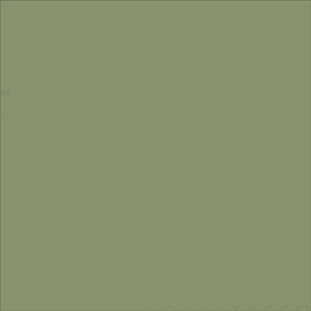

# Hello there!

     
    <i>Decomposition of a image featuring an sunflower using quadtrees. <a href = "https://unsplash.com/photos/macro-shot-of-yellow-sunflower-QwXPI_Vts8g">Original image</a> by <a href = "https://unsplash.com/@hudsoncrafted">Debby Hudson</a>.</i>

## About Me

I’m a **mechanical engineer** by training with strong interest for numerical methods used to **solve partial differential equations**.

### My work primarily revolves around:

- **High-order methods** for increased accuracy and computational efficiency.
- **Immersed boundary techniques** that handle complex geometries seamlessly.
- **Adaptive mesh refinements** that don't destroy/modify the initial mesh and are free from common constraints.

### My other technical interests are:

- **Typesetting with LaTeX**: Whether it is writing documents, making slides or creating graphics, I use LaTeX. I often share my templates and document classes on my GitHub.
- **Open Source Software**: While my time doesn't allow me to contribute much I'm always exploring and utilizing new projects from the FOSS community.
